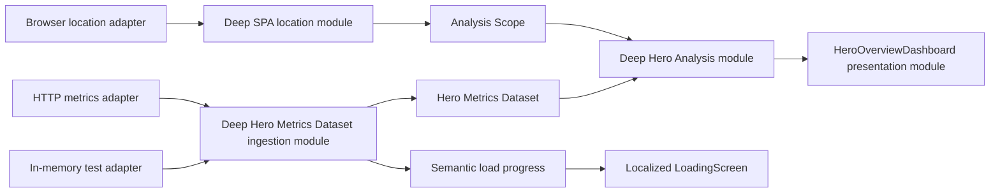

# BazaarPlusPlus Site Architecture Deepening Plan

Status: Complete

Execution model: one Agent, sequential phases, no delegation

Date: 2026-07-18

## Destination

Complete all four agreed architectural improvements while preserving user-visible behavior, the SPA route model, URL contracts, and remote payload contracts:

1. Deepen the **Hero Analysis** module.
2. Deepen the **Hero Metrics Dataset** ingestion module.
3. Replace loading-progress strings with one semantic progress model and localized presentation.
4. Deepen the SPA location module around `src/app/router.ts`.

Every phase must end in a releasable state. The same Agent executes the phases in order and does not begin a later phase until the current gate is green.

## Canonical language

Read [CONTEXT.md](../../CONTEXT.md) before editing. Use these names consistently:

- **Hero Analysis** — derived ranking, trend, matchup, and stage conclusions.
- **Hero Metrics Dataset** — validated, usable daily metrics plus date availability.
- **Analysis Scope** — the selected metric window and rating tier.
- **Dataset Coverage** — requested versus usable dates; missing dates are never zero-filled.

Architecture language must use **module**, **interface**, **implementation**, **depth**, **deep**, **shallow**, **seam**, **adapter**, **leverage**, and **locality**.

## Locked decisions

- This is an architecture refactor, not a product redesign.
- Preserve all visible page content and visual behavior.
- Preserve public routes `/`, `/support`, `/tutorial`, `/download`, and `/heroes`; `/supporters` still canonicalizes to `/support`.
- Preserve URL defaults: Chinese omits `lang`, English uses `lang=en`, `1d` omits `w`, and `all` omits `t`.
- Preserve the client-side route model in `src/app/router.ts`.
- Preserve React Query ownership of runtime fetching and caching.
- Preserve the remote analyzer-v4 contract and the maximum seven-day load.
- Use phases as verification and rollback checkpoints, but keep one complete plan and one executing Agent.
- Do not fix unrelated bugs discovered during the refactor. Record them for follow-up unless they prevent the agreed deepening or violate the agreed data-truth policy.
- Replace obsolete tests instead of layering new tests on top of old implementation tests.
- Do not expose an internal seam merely to keep an old test alive.
- Avoid new runtime dependencies. Explicit internal decoders are acceptable implementation depth.
- Do not commit, stage, push, deploy, or open a pull request unless separately requested.

## Data-truth policy

The ingestion implementation owns this policy in one place:

- Unknown additive fields are ignored for forward compatibility.
- Contractually optional fields and sparse bucket maps are accepted.
- Non-canonical heroes are valid input noise and remain filtered by Hero Analysis.
- Missing or invalid required counters are never guessed, coerced, or replaced with zero.
- An invalid manifest fails the page.
- An invalid daily payload, including an invalid required row, fails that whole date.
- Other valid dates remain usable and Dataset Coverage records the failed date.
- Invalid rows are never silently filtered, because that would create plausible but incomplete statistics.
- Structural checks enforce finite, non-negative integer counters where the current calculations require counters. Do not add arithmetic invariants that the published contract does not guarantee.
- Error classification is structured. No caller may recognize a 404 by parsing `Error.message`.

## Current code evidence

### Hero Analysis friction

- `HeroOverviewDashboard` accepts eight pieces of raw page knowledge in `src/features/heroes/HeroOverviewDashboard.tsx:45-55`.
- It orchestrates day selection, tier filtering, merge, ranking, trend, focus, and coverage in `src/features/heroes/HeroOverviewDashboard.tsx:244-337` and `src/features/heroes/HeroOverviewDashboard.tsx:409-425`.
- `web-daily.ts` exposes intermediate types and nine pipeline functions in `src/shared/lib/web-daily.ts:14-64` and `src/shared/lib/web-daily.ts:79-350`.
- `test/web-daily.test.ts:10-20` imports the entire pipeline, while `test/hero-overview-dashboard.test.tsx:201-417` retests the assembled behavior through the DOM.

### Ingestion seam leakage

- `loadJson<T>` casts unknown JSON to `T` in `src/shared/lib/metrics-client.ts:133-161`.
- The client exposes those casts as typed manifest and daily results in `src/shared/lib/metrics-client.ts:196-204`.
- `page-data.ts` performs validation and recognizes 404 through a regular expression over an error string in `src/app/page-data.ts:189-217`.
- Existing guards only validate top-level tags and arrays in `src/shared/lib/metrics.ts:133-163`, while derivation reads nested counters directly in `src/shared/lib/web-daily.ts:171-199`.
- Production HTTP behavior and the test in-memory client already provide two adapters at a real seam: `src/shared/lib/metrics-client.ts:126-204` and `test/page-data.test.ts:49-58`.

### Loading-progress leakage

- `PageLoadProgress` exposes an arbitrary label string in `src/app/page-data.ts:18-22`.
- The loader constructs English presentation strings in `src/app/page-data.ts:62-89`.
- `LoadingScreen` reparses those strings with `startsWith` and `slice` in `src/app/screens.tsx:11-25`.
- Tests lock both ends to the English implementation in `test/page-data.test.ts:62-75` and `test/loading-screen.test.tsx:7-22`.

### SPA location fragmentation

- Browser reads, canonical replacement, click interception, and history writes are in `src/app/App.tsx:21-95`.
- Route resolution and aliases are in `src/app/router.ts:1-50`.
- Initial Hero scope is parsed in `src/app/route-pages.tsx:26-35`, then parsed again from `window.location` in `src/features/heroes/HeroOverviewDashboard.tsx:106-153`.
- The Dashboard writes history directly in `src/features/heroes/HeroOverviewDashboard.tsx:339-367`.
- Query serialization lives in `src/shared/lib/dashboard.ts:54-82`, while language switching has separate URL logic in `src/shared/components/SiteHeader.tsx:42-55`.
- Route names are also repeated by the Header and copy types in `src/shared/components/SiteHeader.tsx:5-30` and `src/content/site-copy.ts:3-18`.

## Target dependency flow



The Dashboard must not understand raw remote payloads, transport failures, day-merge sequencing, query-string defaults, or browser history.

## Global phase gate

Run all three commands at the end of every phase:

```bash
npm test
npm run typecheck
npm run build
```

Do not continue if any command fails. Diagnose and fix the current phase before advancing.

## Phase 0 — Establish the execution baseline

### Work

- [x] Read `AGENTS.md`, `CONTEXT.md`, this plan, and the handoff prompt completely.
- [x] Run `git status --short` and preserve all existing user changes.
- [x] Run the global phase gate before production edits.
- [x] Record the actual test count in the execution notes. The planning baseline was 22 files and 113 passing tests. Actual: 22 files and 113 passing tests.
- [x] Confirm there is no `CONTEXT-MAP.md` and no existing ADR that changes this plan.
- [x] Confirm these current performance facts in code before preserving them:
  - maximum seven daily payloads: `src/app/page-data.ts:230-246`;
  - default payload concurrency six: `src/app/page-data.ts:44`;
  - per-file degradation through `Promise.allSettled`: `src/app/page-data.ts:239-260`;
  - React Query cache policy: `src/shared/lib/query-client.ts:3-13`.

### Gate

- [x] Working baseline is green.
- [x] No production code changed in this phase.
- [x] Any mismatch between this plan and current code is documented before proceeding; code wins over stale prose. No material mismatch found.

## Phase 1 — Deepen Hero Analysis

### Interface constraints

Create one pure, deterministic, React-free Hero Analysis interface under `src/features/heroes/`.

The interface must:

- accept a Hero Metrics Dataset plus requested Analysis Scope and the focused hero needed for focused conclusions;
- return effective scope, available scope options, Dataset Coverage for the selected window, ranking conclusions, trend conclusions, stage conclusions, and focused matchup conclusions;
- own window selection, tier fallback, count merging, rate derivation, canonical-hero filtering, default domain ordering, trend gap segmentation, matchup sample classification, and focus fallback;
- hide `MergedHeroRow`, row-collection steps, day maps, and all other intermediate types;
- leave React state, hover state, dialog state, SVG geometry, and interactive table sorting in presentation modules;
- keep the trend rule unchanged: fixed seven-day span, selected tier, independent of the selected ranking window.

Use one public operation unless the code demonstrates a second genuinely independent caller. Internal pure helpers are allowed but remain inside the implementation.

### Test-first behavior matrix

Add interface-level tests covering observable Hero Analysis outcomes:

- [x] `1d`, `3d`, and `7d` select the latest published days at or before `latest_complete_day`.
- [x] Fewer available days never produce zero-filled rows.
- [x] Available windows are empty with no usable days and otherwise remain `1d`, `3d`, `7d`.
- [x] Available tiers are the canonical union of usable canonical-hero rows.
- [x] The explicit `all` tier is never reconstructed from low, mid, and high.
- [x] A selected tier with no rows falls back to `all` only when usable `all` rows exist.
- [x] Multi-day counts merge without mutating input.
- [x] All zero denominators return `null`, never `NaN` or `Infinity`.
- [x] Non-canonical heroes do not enter ranking, trend, stage, or matchup conclusions.
- [x] Trend points omit null rates and split at missing dates.
- [x] Matchups preserve mirror rows, apply the existing minimum sample, and preserve ordering.
- [x] Dataset Coverage reports requested, usable, and failed dates for the selected window.
- [x] Focus falls back to the first eligible ranked hero when the requested hero is absent.

### Production migration

- [x] Introduce the deep Hero Analysis module and its small external interface.
- [x] Change the page-data result into the first Hero Metrics Dataset shape needed by the new interface. At this phase the existing transport may still populate it.
- [x] Move available-window and available-tier derivation out of page-data and into Hero Analysis.
- [x] Change `HeroOverviewDashboard` to receive the Dataset and requested scope instead of manifest, raw days, coverage, availability arrays, and multiple pre-normalized selections.
- [x] Replace the pipeline of `selectDays → collectTierRows → mergeRows → derive*` calls with one Hero Analysis call.
- [x] Keep existing visual markup and user interactions unchanged.
- [x] Keep interactive `SortState` in the Dashboard; Hero Analysis supplies domain values and default ordering, not DOM behavior.
- [x] Keep URL reads and writes temporarily unchanged; Phase 4 owns their removal.
- [x] Move every still-valid behavior assertion from `test/web-daily.test.ts` to the Hero Analysis interface test.
- [x] Remove redundant formula assertions from `test/hero-overview-dashboard.test.tsx`; retain rendering, accessibility, and interaction assertions.
- [x] Delete `src/shared/lib/web-daily.ts` and `test/web-daily.test.ts` once no caller or test uses their interface.

### Phase 1 deletion checks

```bash
rg -n "from ['\"].*web-daily" src test
rg -n "MergedHeroRow|collectTierRows|mergeRows|deriveHeroMetrics|deriveTrendSeries|segmentTrendPoints|deriveMatchups" src test
```

Both searches should be empty outside the new module's private implementation, where names may remain unexported.

### Phase 1 gate

- [x] Dashboard crosses one Hero Analysis seam.
- [x] No intermediate derivation type is exported for Dashboard use.
- [x] Old shallow-module tests are deleted, not duplicated.
- [x] Existing UI behavior tests still pass.
- [x] Global phase gate passes (22 files, 103 tests).

## Phase 2 — Deepen Hero Metrics Dataset ingestion

### Target seam

Create one deep ingestion module under `src/features/heroes/` with one external operation that produces a Hero Metrics Dataset.

Use a remote-owned Ports & Adapters seam:

- production HTTP adapter: performs fetch, timeout, retry delay, caller abort handling, and returns unknown JSON or structured transport failure;
- in-memory test adapter: supplies manifest/daily unknown values and structured failures without HTTP;
- ingestion implementation: owns request orchestration, bounded concurrency, decoding, schema selection, one-shot 404 recovery, per-date degradation, Dataset Coverage, and progress lifecycle.

Two adapters justify this seam. Do not introduce additional transport interfaces unless another concrete adapter exists.

### Structured transport failure

- [x] Replace generic `Error.message` parsing with a structured failure carrying status when HTTP supplied one.
- [x] Preserve current retry behavior: 408, 429, and 5xx are transport-retryable; 404 is not retried by the HTTP adapter.
- [x] Preserve the ingestion rule that a daily 404 gets exactly one explicit refetch to tolerate manifest/publication lag.
- [x] Preserve caller abort and timeout behavior.
- [x] Preserve user-visible error messages where the current UI exposes them.

### Internal decoding

Decode unknown JSON inside ingestion. Do not export raw remote types as trusted domain values.

Manifest decoding must verify the fields the current code consumes:

- [x] `schema_version`, `namespace`, `generated_at`, and `latest_complete_day`.
- [x] `web.schema_version` and every day entry's `day`, `path`, and non-negative integer `row_count`.
- [x] Optional `mod`, `dq`, `sli_path`, and duration fields only to the depth actually used; unknown fields remain ignored.

Daily decoding must verify:

- [x] `schema_version`, `kind`, `day`, `generated_at`, and `rows`.
- [x] row hero and supported rating tier.
- [x] required run, outcome, and ten-win-day counters as finite non-negative integers.
- [x] sparse `battle_days`; known buckets must contain valid decided/win/loss counters, and unknown additive keys are ignored.
- [x] matchup entries and their required counters.
- [x] the payload day equals the requested manifest day.

Do not add cross-field arithmetic rejection such as `wins + losses === decided`; the current published data exposes data-quality metadata and the agreed policy is structural compatibility, not a new analyzer audit.

### Loading and coverage behavior

- [x] Load the manifest first and fail the page if it is invalid.
- [x] Select at most the latest seven published dates at or before `latest_complete_day`.
- [x] Keep default concurrency at six and prove it with a test that observes maximum simultaneous daily requests.
- [x] Use per-date isolation so one bad daily payload does not fail other dates.
- [x] Treat any invalid required row as failure of the whole daily payload.
- [x] Sort usable dates ascending before returning the Dataset.
- [x] Record requested, usable, and failed dates once, inside ingestion.

### Migration and test replacement

- [x] Move transport-focused tests from `test/metrics-client.test.ts` to the production HTTP adapter surface.
- [x] Move schema and load-policy tests from `test/metrics.test.ts` and `test/page-data.test.ts` to the ingestion interface.
- [x] Add forward-compatibility cases: unknown fields, sparse buckets, and non-canonical heroes remain accepted.
- [x] Add strict-statistics cases: missing/NaN/negative/non-integer required counters fail the date.
- [x] Add manifest-invalid, daily-invalid, partial-coverage, transient-404, permanent-404, abort, timeout, and bounded-concurrency cases.
- [x] Remove `getSource` and `MetricsSource` if still unused; current production usage is only `src/app/page-data.ts:54` and `src/app/page-data.ts:269`.
- [x] Keep `src/app/page-data.ts` only as a temporary compatibility adapter if Phase 3 still needs the old progress shape. It must contain no transport, validation, or degradation rules.
- [x] Delete superseded client/guard exports and their old tests once replacement coverage is green.

### Phase 2 deletion checks

```bash
rg -n ": 404\\b|isNotFoundError|loadJson<T>|as T" src/app src/features src/shared/lib
rg -n "getSource|MetricsSource" src test
```

The first search must find no error-string classification or unchecked generic JSON cast. The second should be empty unless code evidence demonstrates a real second source.

### Phase 2 gate

- [x] Callers receive only a validated Hero Metrics Dataset.
- [x] Transport and test adapters cross one real seam.
- [x] Data-truth policy is covered at the ingestion interface.
- [x] Maximum requests and concurrency have not increased.
- [x] Global phase gate passes (22 files, 116 tests).

## Phase 3 — Replace loading strings with semantic progress

Resolve this candidate by absorption, not by adding another shallow file: ingestion owns progress lifecycle; `LoadingScreen` owns localized presentation.

### Semantic progress model

Replace `PageLoadProgress.label` with a closed semantic shape containing:

- completed and total counts;
- status: loading, loaded, or failed;
- resource: manifest or a daily date;
- no localized or English presentation string.

The exact TypeScript syntax may vary, but callers must be able to exhaustively render every status/resource pair.

### Localization

- [x] Add any manifest/daily resource labels or templates to `src/content/site-copy.ts` first.
- [x] Preserve current Chinese and English visible wording as closely as possible.
- [x] Render semantic progress inside `LoadingScreen` using localized copy.
- [x] Delete `translateProgressLabel` and all prefix parsing.
- [x] Delete any temporary `page-data.ts` compatibility adapter from Phase 2.
- [x] Route pages consume the ingestion progress type directly.

### Test replacement

- [x] Ingestion tests assert semantic events and counts, never English strings.
- [x] LoadingScreen tests supply semantic events and assert Chinese/English visible output and progressbar accessibility.
- [x] Site-copy tests cover all newly required copy keys.
- [x] Delete tests that assert `Loading web_daily/...` as a loader implementation detail.

### Phase 3 deletion checks

```bash
rg -n "translateProgressLabel|PageLoadProgress|label: ['\"](?:Loading|Loaded|Failed)|loadingPrefix|loadedPrefix|failedPrefix" src test
```

`translateProgressLabel`, progress labels, and prefix-based translation must be gone. Copy keys may remain only if they are still the chosen localized presentation interface; prefer closed status-specific copy names over generic parse prefixes.

### Phase 3 gate

- [x] Ingestion emits semantics only.
- [x] LoadingScreen renders all user-facing loading text from `site-copy.ts`.
- [x] No module reparses another module's presentation string.
- [x] Global phase gate passes (22 files, 117 tests).

## Phase 4 — Deepen SPA location around `router.ts`

This phase preserves the client-side route model required by `AGENTS.md`. Do not install React Router or change deployment fallback behavior.

### Characterize current navigation before migration

Add or consolidate tests for:

- [x] `/` resolves to support.
- [x] `/supporters` and `/supporters/` canonicalize to `/support` while preserving search.
- [x] trailing slashes on valid routes resolve correctly.
- [x] unknown and removed routes remain not-found.
- [x] internal primary clicks use client-side navigation.
- [x] external origins, `target`, `download`, modifier-clicks, and same-page hashes retain browser-default behavior.
- [x] canonical replacement uses replace semantics.
- [x] filter scope changes use replace semantics and do not add history entries.
- [x] normal internal link and language navigation preserve current push semantics.
- [x] `popstate` refreshes the App location model.
- [x] default query values are omitted and existing unrelated supported values are preserved where current behavior preserves them.
- [x] Chinese/English locale toggles preserve path, scope, and hash.

Do not use this phase to fix unrelated navigation edge cases. Characterize current behavior first; record any unrelated defect separately.

### Deep module responsibilities

Deepen `src/app/router.ts` and, if necessary, one adjacent browser adapter module so that the implementation owns:

- route catalog, aliases, normalization, and canonical path;
- route-to-page/title/navigation identity;
- locale and Analysis Scope parsing with defaults;
- localized href and query serialization;
- push, replace, popstate, and internal-link eligibility rules;
- a local-substitutable browser seam with production browser and in-memory test adapters.

Keep the external interface small. Callers should consume a resolved location/navigation model and explicit navigation operations, not individual parsing helpers.

### Production migration

- [x] Make route identity a single source of truth for App, Header navigation, and page-title keys.
- [x] Move `parseLocale`, `parseMetricWindow`, and `parseRatingTier` out of the metrics grab-bag and behind the location interface.
- [x] Move `buildLocalizedHref` out of `src/shared/lib/dashboard.ts` and behind the location interface.
- [x] Remove `buildLocaleToggleHref` from `SiteHeader`.
- [x] Remove `readInitialSelection`, duplicate window/tier guards, and direct URL writes from `HeroOverviewDashboard`.
- [x] Remove `URLSearchParams` parsing from `route-pages.tsx`; it receives resolved Analysis Scope.
- [x] Ensure no presentation module reads `window.location` or writes `window.history`.
- [x] Keep App title and `<html lang>` synchronized from the resolved location model.
- [x] Preserve lazy loading of the Hero route; `test/app-code-splitting.test.tsx:20-30` remains green.
- [x] Remove the unused `hero` query serialization capability unless current code reveals a real caller or public contract.

### Test replacement

- [x] Consolidate route mapping, query round-trip, canonicalization, history semantics, and locale preservation at the deep location interface.
- [x] Keep Header tests focused on rendered links and accessibility, not direct global-history setup.
- [x] Keep Dashboard tests focused on filter interaction callbacks and rendering, not direct `window.history` assertions.
- [x] Use the in-memory location adapter for navigation behavior; use App integration tests only for DOM click interception and document metadata.

### Phase 4 deletion checks

```bash
rg -n "window\\.(location|history)|new URLSearchParams" src --glob '!src/app/router.ts' --glob '!src/app/*location*.ts'
rg -n "buildLocalizedHref|buildLocaleToggleHref|readInitialSelection|parseMetricWindow|parseRatingTier|parseLocale" src
```

The first search should be empty outside the location implementation. The second may find only private names inside the deep module; no presentation caller may import them individually.

### Phase 4 gate

- [x] Router/location knowledge has one source of truth.
- [x] Production browser and in-memory adapters prove the seam.
- [x] No presentation module touches browser globals.
- [x] Public routes and query defaults are unchanged.
- [x] Global phase gate passes (22 files, 137 tests).

## Phase 5 — Remove transitional structure and verify the destination

### Deletion test and cleanup

- [x] Apply the deletion test to every transitional module and adapter.
- [x] Delete `src/app/page-data.ts` if Phase 3 has removed its last real responsibility.
- [x] Delete or reduce `src/shared/lib/metrics-client.ts` if the production HTTP adapter has moved to the Hero feature.
- [x] Delete `src/shared/lib/metrics.ts` if its remaining types have a clearer owning deep module; do not keep a generic grab-bag solely to avoid import edits.
- [x] Remove unused exports, compatibility aliases, stale comments, dead types, and old tests.
- [x] Do not split private helpers into new shallow modules for testability.
- [x] Verify that any retained shared module has at least two real callers or passes the deletion test.

### Documentation alignment

- [x] Update `docs/architecture.md` to describe the final code, not this plan.
- [x] Keep `CONTEXT.md` implementation-free and update it only if execution sharpens a domain term.
- [x] Do not create an ADR unless execution introduces a hard-to-reverse, surprising trade-off not already settled here.
- [x] Remove statements in docs that conflict with final code; code remains the source of truth.

### Final automated verification

```bash
npm test
npm run typecheck
npm run build
git diff --check
git status --short
```

### Final manual smoke test

Start the local server on the project-mandated port:

```bash
npm run dev
```

Verify at `http://localhost:3000`:

- [x] `/` and `/support` render support in default Chinese.
- [x] `/supporters?lang=en` canonicalizes to `/support?lang=en`.
- [x] `/tutorial` and `/download` render and preserve locale navigation.
- [x] `/heroes` loads, reports progress, and renders current data.
- [x] `w` and `t` hydrate, update, and omit defaults exactly as before.
- [x] language switching preserves current route and supported scope.
- [x] ranking sort, focus, trend hover, matchup list, stage sort, coverage notes, and tier fallback behave as before.
- [x] browser back/forward behavior matches the characterized tests.
- [x] no console errors or React warnings appear.

Stop the dev server after the smoke test.

## Final definition of done

The plan is complete only when all statements below are true:

- HeroOverviewDashboard crosses one Hero Analysis interface and contains presentation logic rather than derivation orchestration.
- Hero Analysis is pure, deterministic, React-free, and tested through its external interface.
- Ingestion returns a validated Hero Metrics Dataset and centrally owns compatibility, transport classification, decoding, concurrency, retry, degradation, and Dataset Coverage.
- The production HTTP adapter and in-memory test adapter are the only justified transport adapters.
- Loading progress is semantic across the ingestion seam and localized only at presentation.
- `router.ts` remains the SPA route authority and the deep location module owns URL/history rules.
- No presentation module reads or writes browser location globals.
- Old shallow interfaces and their implementation-coupled tests are deleted.
- No user-visible text is introduced outside `src/content/site-copy.ts`.
- No public route, URL default, user-visible behavior, request count, or remote payload contract changes unintentionally.
- All automated and manual verification passes.
- The final handoff reports changed modules, deleted modules/tests, preserved contracts, verification commands, and any explicitly deferred unrelated defects.

## Not yet specified

None. The grilling session resolved destination, sequencing, data-truth policy, compatibility policy, scope control, testing policy, and the shape of Hero Analysis. Implementation details may vary only inside the constraints above.

## Out of scope

- Visual redesign or copy rewrite.
- New product features, routes, filters, metrics, or locales.
- Deployment-strategy changes.
- Analyzer or remote publication changes.
- Fixing unrelated existing navigation or UI bugs.
- New framework/router/schema dependencies.
- Parallel-agent execution.
